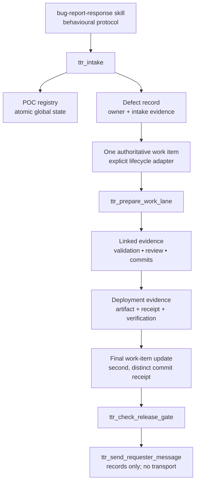

# Triage Control Plane (TTR)

Global Pi extension implementing the structured control-plane portions of `~/.agents/skills/bug-report-response/SKILL.md`. The skill remains responsible for triage, diagnosis, TDD, review, and orchestration behaviour; this extension tracks authoritative state and supported gates.

## Purpose

TTR makes the protocol's control plane durable and inspectable without replacing the policy skill or automating unsafe external actions. It answers four control questions before work advances:

1. **Who owns this defect domain?** The active designated POC.
2. **What is the single tracking authority?** The defect's one authoritative work item.
3. **What evidence supports the next transition?** Linked intake, validation, review, commit, deployment, and requester-message evidence.
4. **May a supported release or safe-to-proceed action advance?** Only if the fail-closed release gate passes.

## Architecture



### Components

| Component | Responsibility |
| --- | --- |
| `index.ts` | Pi command and custom-tool registration; retrieves the supported Pi session ID and performs cwd-aware Git inspection. |
| `src/core.ts` | Testable domain model, atomic lock/file storage, POC resolution, work-item invariants, evidence recording, and release-gate logic. |
| `explicit-lifecycle` adapter | Stores caller-configured repository lifecycle states. It does not infer statuses or edit repository backlog files. |
| `README.md` | Operational contract, boundaries, installation, and examples. |

## State and safety

- Durable global state: `$PI_CODING_AGENT_DIR/triage-control-plane/state.json` (default `~/.pi/agent/triage-control-plane/state.json`), written through an exclusive lock plus atomic temp-file rename with restrictive permissions.
- POC session IDs come from `ctx.sessionManager.getSessionId()` (the documented session API); the `/ttr-register` command never guesses one.
- Secrets are not accepted in records or tools. Store only evidence references/paths, receipts, and commit SHA evidence.
- The built-in `explicit-lifecycle` adapter stores the caller-supplied lifecycle states alongside the authoritative ID/path. It intentionally does **not** invent repository status names or mutate a repository work item. A repository integration can implement the exported `WorkItemAdapter` seam.

## Enforcement boundaries

Enforced by supported TTR tools:

- one active domain POC, explicit confirmation before active POC replacement;
- evidence-only handoff generation in non-POC sessions;
- `ttr_prepare_work_lane` refuses to produce a supported diagnosis/review/validation/implementation lane contract until the authoritative work item exists, and its emitted preamble must be passed to the lane;
- exactly one authoritative work-item reference per TTR defect, and only its configured lifecycle states;
- requester-message category validation and evidence recording;
- release-gate checks for authoritative item, clean Git tree, commit/validation/review evidence, deployment artifact/receipt/verification, final post-deployment item update, and linked **distinct** second commit evidence;
- `safe-to-proceed` only after the supported gate passes.

Not enforceable globally:

- direct arbitrary `subagent` calls cannot be reliably associated with a defect, so the extension cannot truthfully block every lane launched outside `ttr_prepare_work_lane`;
- generic inbound `intercom` messages cannot be intercepted by this extension. Pi-intercom injects them into a recipient through its own private inbound handler. The extension bus is opaque extension-channel traffic, not a generic-message hook.
- the extension does not attempt heuristic blocking of arbitrary `bash`, `user_bash`, deploy, publish, or manual messaging commands. Those paths may be warned about by process policy but cannot be truthfully claimed as fully blocked.
- `ttr_send_requester_message` records a permitted message only. It has **no external transport** and never sends email, chat, comments, deployments, publications, or releases.
- a clean Git tree and linked SHA evidence prove supported gate prerequisites, but cannot prove that arbitrary hidden/external changes are in scope. Deployment authorization remains human/repository process authority.

### Sender-side non-POC handoff contract

`ttr_intake` returns a `targetSessionId`, `delivery: "not-attempted"`, and the minimal evidence-only payload. If and only if the POC session is a known established reachable channel, use exactly the target emitted by the tool:

```ts
intercom({ action: "send", to: "<returned targetSessionId>", message: "<returned payload JSON>" })
```

Do not substitute a name, fabricate a target, or silently reroute an unreachable POC. If reachability is unknown, keep the payload in TTR state and request an authorized replacement route.

## Commands

```text
/ttr-register payments                    # this session is POC
/ttr-register payments <pi-session-id>    # explicit POC
/ttr-register payments <id> --replace     # required to replace an active POC
/ttr-poc payments
/ttr-pocs
/ttr-deactivate payments
```

## Tool examples

```ts
// Record intake. Non-POC sessions receive a handoff only and must not start diagnosis/writer lanes.
ttr_intake({
  reporter: "customer", source: "support:123", domain: "payments",
  symptom: "card declined", impact: "checkout blocked", environment: "prod",
  reproduction: "submit Visa test card", evidenceReferences: ["ticket:123", "request:req-7"]
})

// Before any diagnosis/design/implementation/review/validation/deployment lane:
ttr_assign_work_item({
  defectId: "ttr-…", workItemId: "BUG-123", workItemPath: "backlog/BUG-123.md",
  status: "in-progress", lifecycleStates: ["proposed", "in-progress", "ready-for-review", "closed"]
})

// Required supported-lane preamble to pass into any diagnosis/review/validation/implementation lane:
ttr_prepare_work_lane({ defectId: "ttr-…", lane: "diagnosis" })

ttr_record_evidence({ defectId: "ttr-…", type: "validation", status: "passed", path: "evidence/repro.txt" })
ttr_record_evidence({ defectId: "ttr-…", type: "review", status: "passed", path: "evidence/review.md" })
ttr_record_commit_evidence({ defectId: "ttr-…", sha: "<commit-sha>", phase: "pre-deployment", path: "evidence/commit.json" })

// Records evidence for an already-authorized deployment; it never deploys.
ttr_record_deployment_evidence({ defectId: "ttr-…", artifact: "app@1.2.3", receipt: "deploy:42", verification: "healthcheck passed" })
ttr_transition_work_item({ defectId: "ttr-…", status: "closed", nextAction: "none" })
ttr_record_commit_evidence({ defectId: "ttr-…", sha: "<final-work-item-update-sha>", phase: "post-deployment", path: "evidence/final-commit.json" })
ttr_check_release_gate({ defectId: "ttr-…", deploymentRequired: true })

// Records an allowed message; it deliberately does not transmit it.
ttr_send_requester_message({ defectId: "ttr-…", category: "safe-to-proceed", message: "You may proceed. Monitoring is healthy.", deploymentRequired: true })
```

## Installation/reload

This extension is loaded through this package's `pi.extensions` manifest entry:

```text
extensions/triage-control-plane/index.ts
```

Install or link the `pi-extensions` package in Pi, then restart Pi or run `/reload`. For isolated load testing from the repository root:

```bash
pi -e extensions/triage-control-plane/index.ts
```

## Test

```bash
cd /path/to/pi-extensions
node --import tsx --test test/triage-control-plane.test.mjs test/triage-control-plane-core.test.mjs
```
